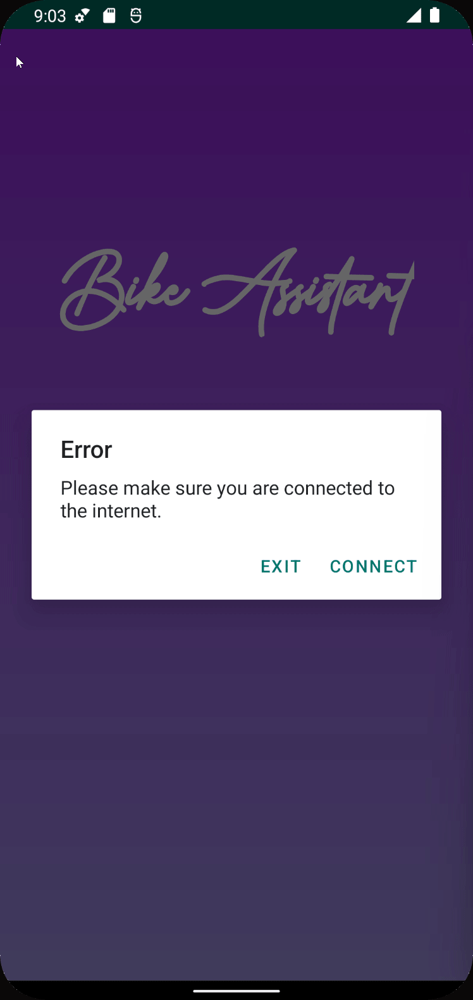

# Internet Connection Checking


**Good to know: C**onnectivity to the internet will be checked. This functionality is to make sure that the user have the ability to connect to the back-end, real-time and semi-real-time APIs of the city of Calgary and Google's.


In case the user is not connected to the Internet an alert will be shown to ask the user to activate a WiFi or mobile connection. In case that the user doesn't want to connect to the Internet there is an exit button that closes the application as this application cannot work without the Internet



